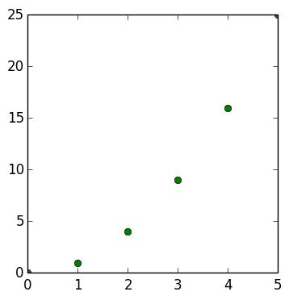
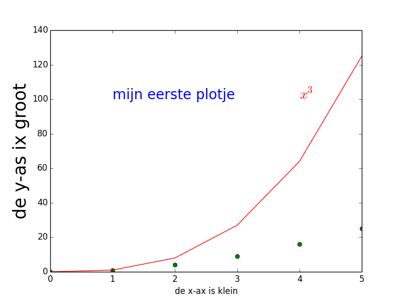
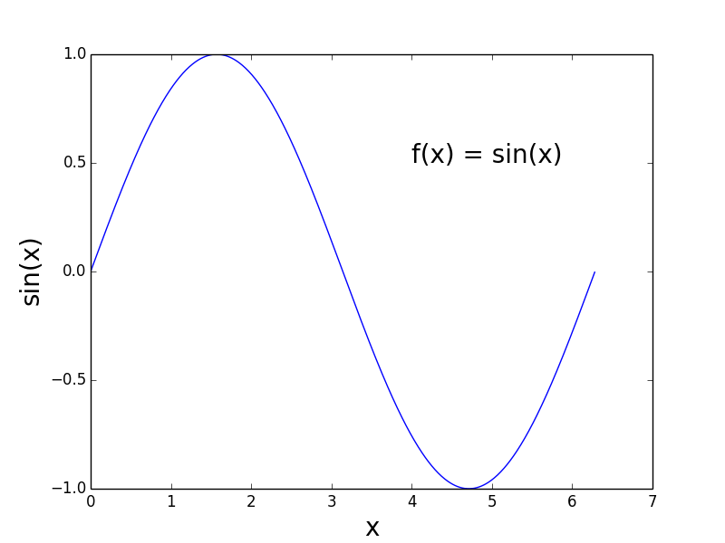

# Gebruik functies en importeren standaard modules

Je hebt in de vorige opgaves gezien dat er stukjes code zijn die je kan hergebruiken. Deze stukjes code die en wel gedefinieerde taak uitvoeren noemen we *functies* en die zullen we in module 2 en 3 in meer detail bekijken en gebruiken.

In python zijn er een beperkt aantal standaard functies beschikbaar. Je kan bijvoorbeeld een getal printen op het scherm mbv `print`, maar je kan niet sin(0.5) uitrekenen. Je hebt daarvoor de functie `sinus` nodig. Die is niet beschikbaar in standaard Python, maar is ondergebracht in de zogenaamde wiskunde bibliotheek (`math library`). Om gebruik te maken van de `sinus` functie moet je dus eerst zorgen dat de wiskunde bibliotheek en alle functies daarin beschikbaar komen in jouw programma. Dat doe je als volgt. 

	import math			# importeer de wiskunde bibliotheek
	
	x = 0.5
	print math.sin(x)

Als je de functie `sin()` wilt gebruiken moet je altijd duidelijk aangeven in welke bibliotheek Python die functie moet vinden. Er zouden in andere bibliotheken namelijk ook `sin` functies gedefinieerd kunnen zijn die misschien helemaal niks met de sinus uitrekenen te maken hebben. Je moet hier dus expliciet aangeven dat je de `sin` functie uit de wiskunde bibliotheek wilt gebruiken.

*Informatie over libraries:*

- De functies die beschikbaar zijn in de math library kan je vinden in de documentatie:

  https://docs.python.org/2/library/math.html
- Er zijn een aantal standaard libraries:

  https://docs.python.org/2/library/
- Voor elk vakgebied of toepassing is wel een aparte library te vinden en zodra je zelf later in je studie aan grotere programma's gaat werken zal het handig zijn om standaard code in een library onder te brengen. Het komt de overzichtelijkheid ten goede en je kan je code zo ook goed delen met andere mensen.

Een voorbeeld van een wiskunde-georienteerde library is de `numpy` library. Een overzicht, documentatie en voorbeelden kan je hier vinden: http://www.numpy.org Een handige functie die we in deze cursus een paar keer zullen gebruiken is arange.

De functie `range()` die we eerder in de cursus gebruikt hebben in `for loops` werkt alleen met gehele getallen. Vaak wil je echter kleine stapjes nemen. Als je bijvoorbeeld alle waardes van 2 tot 9 wilt gebruiken in stapjes van 0.01 dan is dat niet heel makkelijk te programmeren. Met behulp van de `numpy.arange()`` functie kan dat in 1 regel: handig!

	import numpy

	for x in numpy.arange(2.0, 9.0, 0.01):
    	print x

# Opgave: bereken de hoek tussen 2 vectoren

Schrijf een functie `Hoek.py` dat de hoek tussen 2 vectoren berekent in graden (en dus niet in radialen) en op het scherm print.

Het inprodukt van 2 vectoren $$V_1$$ en $$V_2$$ ($$V_1 \cdot V_2$$) is te schrijven als het produkt van de lengtes van de vectoren en de cosinus van de openingshoek tussen de 2 vectoren:

$$ V_1 \cdot V_2 = |V_1|~|V_2|\cos(\theta)$$

In deze uitdrukking is $$V_1 \cdot V_2 = x_1x_2 + y_1y_2$$, $$\|V_i\|$$ de lengte van vector $$V_i$$ en $$\theta$$ de openingshoek in radialen.

Gebruik als vectoren $$V_1$$ = (2,5) en $$V_2$$ = (1,2) en zorg dat de output op het scherm weergegeven wordt als :

    De hoek tussen (2,5) en (1,2)  is <youw resultaat> graden.

### Tip: gebruik de functie {\tt acos} uit de {\tt math} library.

# Visualisatie: plotten en grafieken

Het is vaak handig om je resultaten te visualiseren (grafiek of zelfs een filmpje). Dit is erg belangrijk om aan het eind van het project je resultaten weer te geven, maar ook tijdens het ontwikkelen van (lees 'vechten met') je code. Tijdens het programmeren loop je vaak tegen problemen waarbij de computer niet lijkt te doen wat jij wilt. Dit zogenaamde debuggen, het uitzoeken waar je programa een andere lijn volgt dan de logica die jij erin denk te hebben gestopt, gebeurt vaak door op bepaalde plekken dingen te printen. Een visueel beeld is ook heel sterk omdat het je vaak in 1 oogopslag zien waar het probleem zit.

Om je boodschap en conclusies goed over te brengen is het belangrijk dat je aandacht besteedt aan hoe je je resultaten weergeeft zodat het voor je publiek duidelijk is. Dit is cruciaal. Vaak duurt het oplossen van het probleem zelf uren/dagen/weken. Neem dan even 10 minuten de tijd om de grafiek netjes en duidelijk te maken. 

Er is een standaard pakket om resultaten visualiseren in python: `Matplotlib`. Het is een zeer omvangrijk pakket waarvan we maar een fractie nodig zullen hebben. Een goede tutorial kan je hier vinden:
http://matplotlib.org/users/pyplot_tutorial.html

> Er bestaat een enorme variatie in de manier waarop data en resultaten gevisualiseerd worden. Denk altijd na hoe *jij* denk dat je het best de informatie weer kan geven zodat de gebruiker de juiste conclusie trekt. Zoek vervolgens in de Matplotlib documentatie op hoe je dat voor elkaar kan krijgen.

Hieronder drie simpele voorbeelden zodat je de basiscommando's kent waarmee je de opgaves van deze week kan maken.

## Stap 1: lijst met punten (x,y) plotten op het scherm 

We beginnen met het plotten van wat punten waarvan we de x-waardes (0,1,2,3,4,5) en de y-waardes (0,1,4,9,16,25) hebben. In dit geval is het precies de functie x-kwadraat, maar dat hoeft natuurlijk niet. Om daar een grafiek van te maken doen we het volgende:

    import matplotlib.pyplot                   # importeer grafiek-maak module Matplotlib
	
    L_x = [0,1,2,3,4,5]                        # definieer lijst met x-waardes punten
    L_y = [0,1,4,9,16,25]                      # definieer lijst met y-waardes punten
	
    matplotlib.pyplot.plot(L_x, L_y,'go')      # plot punten (y tegen x) met groene rondjes	
	
    matplotlib.pyplot.show()                   # laat de grafiek op het scherm zien

Hierbij is ervoor gekozen om de 'marker' (figuur waarmee elk elk punt weergegeven wordt) weer te geven als een groen puntje. Vandaar het commando `'go'`. Als je een rode lijn had gewild die elk van de punten verbindt dat had je ook voor `'r-'` kunnen kiezen. 

###Tip:
Om veel schrijven te voorkomen kan je een lange modulenaam ook intern in jouw stuk code een functie of mudule men een lange naam een zelfgekozen kortere naam weergeven.

    import matplotlib.pyplot as plt
	
    L_x = [0,1,2,3,4,5]
    L_y = [0,1,4,9,16,25]
	
    plt.plot(L_x, L_y,'go')

    plt.show()

## Stap 2: verschillende grafieken tegelijk, tekst en asbijschriften

En natuurlijk behoren de assen labels te hebben, kan je 2 verschillende grafieken in 1 plot zetten en kan je zelf tekst weergeven. Om ook de grafiek x^3 in de grafiek te zetten (met rode lijnen) doe je het volgende:

    import matplotlib.pyplot as plt
	
    L_x  = [0,1,2,3,4,5]
    L_x2 = [0,1,4,9,16,25]
	L_x3 = [0,1,8,27,64,125]
	
	plt.plot(L_x, L_x2,'go', L_x, L_x3,'r-')                                  # plot 2 grafieken tegelijk
	
	plt.xlabel('de x-ax is klein')
	plt.ylabel('de y-as ix groot', fontsize = 25)
	plt.text(1.00,100., "mijn eerste plotje", color = 'blue', fontsize = 20)
	plt.text(4.00,100., "$$x^3$$", color = 'red', fontsize = 20)

	plt.show()

## Stap 3: hoge resolutie grafieken

In stap 2 hebben we een klein aantal punten gekozen waarbij je de waardes 
zelf in moet vullen. De grafiek ziet er dan ook niet bepaald mooi uit. Je kan natuurlijk met de computer ook zelf x-waardes en bijbehorende y-waardes berekenen en in lijsten opslaan. Als we bijvoorbeeld de functie sin(x) willen plotten in stapjes van 0.01 tussen 0 en 2*pi dan knopen we de verschillende dingen die we dit blok geleerd hebben aan elkaar en doen we het volgende:

	import numpy as np               # numpy mdule: nodig voor arange-functie
	import math                      # math module: nodig voor sin()-functie
	import matplotlib.pyplot as plt  # pyplot module: nodig voor plotten

	L_x = []
	L_y = []

	for x in np.arange(0,2*math.pi, 0.01):  # x loopt van 0 tot 2pi in stapjes van 0.01

		y = math.sin(x)                     # bereken de y-waarde: y = sin(x)

		L_x.append(x)                       # sla x-waarde op in lijst
		L_y.append(y)                       # sla y-waarde op in een lijst

	plt.plot(L_x, L_y,'b-')                 # plot x tegen y

	plt.xlabel('x', fontsize = 20)
	plt.ylabel('sin(x)', fontsize = 20)
	plt.text(4.00,0.50, "f(x) = sin(x)", color = 'black', fontsize = 20)

	plt.show()

# Opgave: de grafiek $$x^x$$

Maak een grafiek (blauwe lijn) van de functie $$f(x) = x^x$$ tussen x = 0 en x=1.5 stapjes van 0.01. Zorg ook dat je aan het eind van het berekenen van alle punten weet bij welke x-waarde de functie zijn minimum bereikt. Teken dat minimum met behulp van een rode stip in de grafiek en print de waarde van het minimum aan het eind van je programma. Als extra kan je ook proberen de waarde van het punt in de grafiek zelf te zetten.

Je bent niet voor niks natuurkundige naturlijk: bereken dit punt ook analytisch met behulp van pen en papier. 

# Hackeropgave: priemgetallen tellen 

Schrijf een programma dat een grafiek maakt van de functie $$\pi$$(x), waarbij $$\pi$$(x) het aantal priemgetallen weergeeft kleiner dan of gelijk aan x. Maak hierbij gebruik van je programma uit opgave 3 en kijk alleen naar getallen onder x = 10000.

het begin van de functie $$\pi$$(x): 

- $$\pi$$(2) = 1  (priemgetallen 2)
- $$\pi$$(3) = 2  (priemgetallen 2,3)
- $$\pi$$(4) = 2  (priemgetallen 2,3) 
- $$\pi$$(5) = 3  (priemgetallen 2,3,5)
- ...

Aan het eind van de 18e eeuw is door Gauss en Legendre gepostuleerd dat de functie voor grote getallen benaderd wordt door $$\pi$$(x) = x/ln(x). Teken dus door de grafiek van $$\pi$$(x) die je zelf gevonden hebt ook de functie van Gauss en Legendre. En ?

De grafiek zelf en wat (getaltheorie)wiskunde erachter kan je hier:

https://en.wikipedia.org/wiki/Prime-counting_function

