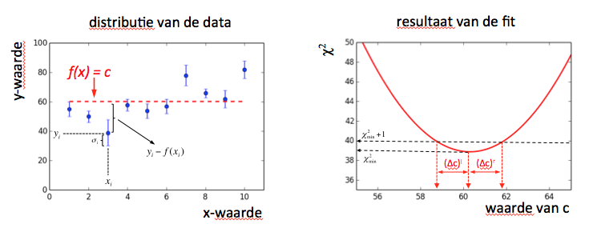

# Fitten van data en foutenbepaling 

Om de onderliggende fenomenen van (natuurkundige) verschijnselen te achterhalen wordt data verzameld om 
afhankelijkheden te onderzoeken. Dat kan de massa van het Higgs boson zijn, de vervaltijd van uranium, 
maar ook het aantal kinderen in een gezin als functie van de gemiddelde lengte van de ouders. Je kan dan 
zoeken naar een (causaal) verband: lineair, exponentieel,etc. en daarbij ook de bijbehorende parameters 
bepalen met hun onzekerheid. Als je een goede beschrijving hebt gevonden kan je daarmee vervolgens ook 
voorspellingen doen. Elk meetpunt komt met een onzekerheid die de precisie aangeeft waaramee een grootheid 
gemeten is. Hoe kleiner de fout, hoe nauwkeuriger de meting en hoe 'belangrijker' hij is als je gaat kijken 
of de meetpunten wel met je model overeenkomen. 

Om de 'beste' waarde te vinden hebben we een maat (metriek) nodig die de *goedheid* van de fit beschrijft. 
We doen dat hier met de $$\chi^2$$-maat: de som van de gemiddelde afwijking van de meetpunten tot het model 
gewogen met hun fout. 

Voor elk punt bepalen we dus *hoeveel standaardafwijkingen ligt dit punt weg van mijn model/voorspelling ?*

$$\chi^2 = \sum_{i~ {\rm (datapunten)}}  \left(\frac{  y_i - f(x_i|\vec{\alpha}) }{\sigma_i}\right)^2$$

Hierbij is $$\vec{\alpha}$$ de vector met de parameters die je gebruikt in je model. 
Voor elke keuze van de parameters je model verandert de afstand van elk meetpunt tot je model en krijg je 
dus een nieuwe $$\chi^2$$. Ter volledigheid: de $$\chi^2$$ is gewoon een getal.

## De beste waarde van je model ($$\alpha_{best}$$) en de onzekerheid daarop ($$\Delta_{alpha}$$)

In de fitprocedure zoeken we naar de waarde van de parameters in je model die de kleinste $$\chi^2$$ opleveren. 
Dat zijn namelijk de 'beste' waardes van het model omdat met die waarde van de parameters je model de data het 
best beschrijft.

Elke waarde van je parameters die anders is dat $$\alpha_{best}$$ zal de waarde van de $$\chi^2$$ veranderen 
(die wordt groter wat een slechtere overeenkomst met de data betekent). Het verschil tussen de waarde van de 
$$\alpha$$ waarbij de $$\chi^2$$ precies 1 unit toeneemt en $$\alpha_{best}$$ noemen we de onzekerheid. 

Het resultaat van je fit presenteer je dan als volgt:

$$\alpha = \alpha_{best} \pm \Delta_{alpha}$$

Hoewel we hier aannemen dat de fout in $$\alpha$$ symmetrisch is hoeft dat niet altijd het geval te zijn. 
Evalueer dus altijd de negatieve en positieve fout afzonderlijk door te kijken hoe de $$\chi^2$$ verandert 
als je de parameters respectievelijk kleiner en groter maakt.

# Voorbeeld fit: de fractie goede passes van Wesley Sneijder

Iemand heeft heel keurig het percentage goede passes (y-waarde) bepaald die Wesley Sneijder heeft gegeven 
tijdens de verschillende wedstrijden (x-waarde) tijdens de kwalificatie voor het WK voetbal. Omdat 
de nauwkeurigheid waarmee het percentage bepaald wordt afhangt van het aantal passes in een 
wedstrijd is de fout erop niet voor elke wedstrijd hetzelfde.

wedstrijdnummer (x)     |  1 |  2 |  3 |  4 |  5 |  6 |  7 |  8 |  9 | 10 
$$f_{goed}$$ (y)        | 55 | 50 | 39 | 58 | 54 | 57 | 78 | 66 | 62 | 82 
$$\sigma$$ (fout op y)  |  5 |  4 |  9 |  4 |  5 |  5 |  7 |  3 |  6 | 6

De data is weergegeven in de linker plot hieronder. 
We nemen aan dat zijn prestaties constant zijn en nemen daarom aan dat het model dat deze data het best 
beschrijft een constante is. We nemen dus aan dat de vector $$\vec{alpha}$$ maar uit 1 parameter bestaat. 
Meet precies, ons model neemt de vorm aan van $$f(x)=c$$. De vraag is nu: *welke waarde van $$c$$ beschrijft 
de data het best en welke onzekerheid moeten we aan die schatting toekennen ?*

### uitrekenen $$\chi^2$$

We gaan verschillende waardes van $$c$$ proberen en rekenen voor elke de $$\chi^2$$ uit. Als we bijvoorbeeld 
als hypothese $$c=56%% nemen dan hoort daar de volgende $$\chi^2$$ bij:

$$
\tiny
   \chi^2(c=56)~=~    
   \left( \frac{(55-56)}{5} \right)^2
   \left( \frac{(50-56)}{4} \right)^2
   \left( \frac{(39-56)}{9} \right)^2
   \left( \frac{(58-56)}{4} \right)^2
   \left( \frac{(54-56)}{5} \right)^2
   \left( \frac{(57-56)}{5} \right)^2
   \left( \frac{(78-56)}{7} \right)^2
   \left( \frac{(66-56)}{3} \right)^2
   \left( \frac{(62-56)}{6} \right)^2
   \left( \frac{(82-56)}{6} \right)^2
   ~=~47.07
$$

### zoeken naar de waarde van $$c$$ die de $$\chi^2$$ minimaliseert: $$c_{best}$$

Je kan nu verschillende waardes van $$c$$ proberen en voor elk de $$\chi^2$$ berekenen. De distributie 
is getekend in de rechterplot hierboven. Er is een duidelijk minimum zichtbaar: bij $$c=60.3$$ is de 
$$\chi^2$$ minimaal, namelijk $$\chi^2_{min} = 38.87$$. Dat is de waarde van $$c$$ die de distributie 
het best beschrijft.

### zoeken naar de $$\chi^2$$ minimaliseert
Bij het berekenen van de $$\chi^2$$ zien we dat er een gebied is $$ 58.8 < c <61.8$$ waarvoor de $$\chi^2$$ 
minder dan 1 unit verschilt van $$\chi^2_{min}$$. De linkergrens en rechtergrens in hypotheses van $$c$$ 
zijn beide 1.5 van  $$c_{best}$$ verwijderd. De onzekerheid op $$c$$ is dus 1.5.

Het resultaat van de fit van ons model aan de data is als volgt:

Percentage goede passes = $$ 60.3 \pm1.5$$

# Opgave: fitten van een model aan de data

~~\\
{\bf opgave [2]: fitten van een model aan de data}\\
~~\\De onderstaande data-set geeft voor een specifieke voetballer het percentage goede passes ($y$) weer als functie van het aantal gespeelde wedstrijden in oranje ($x$). De onzekerheid op het aantal goede passes is weergegeven als $\sigma_y$.\\
\begin{center}
\begin{tabular}{|c||r|r|r|r|r|r|r|r|r|r|}
     \hline
     $x$            &   1  &   2  &    3  &   4  &   5  &   6   &   7   &  8   &   9   &10\\
     \hline
      $y$           & 55  & 50  &  39  & 58  & 54  & 57   & 78  & 66   & 62  & 82\\
     \hline
   $\sigma_y$ &   5  &   4  &    9  &   4  &   5  &   5   &   7   &  3   &   6  &   6\\
     \hline
\end{tabular}
\end{center}

\begin{tabbing}
a)~\=maak een plot van deze data met fouten\\ 
    \>Computing tip: gebruik de functie {\tt plt.errorbar(x,y, yerr=yerror)}\\
~~\\
b) \>bereken de beste waarde van c als $f(x)=$c en de bijbehorende onzekerheid $\Delta$c.\\
~~\\
c) \>Wat gebeurt er met $\Delta$c als de fout in elk meetpunt 2x kleiner wordt ?
\end{tabbing}

