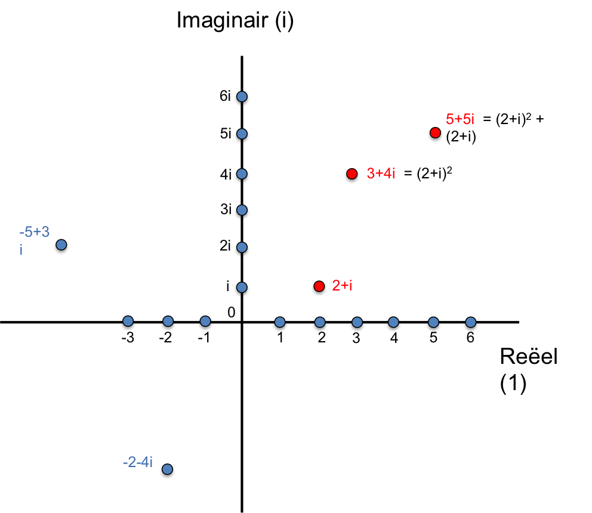

# Fractals - Mandelbrot set

Jullie kennen vast wel die prachtige en veelkleurige plaatjes waarin patronen zich tot een oneindige diepte patronen herhalen. Deze zeer complexe patronen, **fractals** genaamd, komen gek genoeg voort uit een kleine set simpele (wiskundige) regels, iets dat we ook in de natuur regelmatig zien. In deze opgave gaan we iets meer in op de wiskunde achter de fractals en gaan we proberen daarmee zelf de meest bekende fractal te reconstrueren en te tekenen: de [Mandelbrot set](https://en.wikipedia.org/wiki/Mandelbrot_set)

{: style="width:50%"}

De opdracht van deze extra opdracht is dan ook: schrijf een programma `fractal.py` dat de Mandelbrot set op het scherm tekent.

### Stukje wiskunde: complexe getallen

Om iets te begrijpen van de wiskunde achter de fractals moeten we eerst een nieuw wiskundig concept introduceren: **complexe getallen**. Deze getallen hebben een speciale plek in wiskunde en ze komen overal in de natuurkunde terug. Jullie zullen de geheimen ervan later dan ook in verschillende colleges tegenkomen. Hier het absolute minimum.

   - definitie: we definiëren $$ i = \sqrt{-1}$$
   
Een complex getal (c) bestaat uit twee componenten: een reëel deel ($$\alpha$$) en een extra imaginair deel ($$\beta i$$):

   - complex getal: c = $$\alpha + \beta i$$

Een gebruikelijke manier om deze getallen voor te stellen is in het zogenaamde **complexe vlak**, een 2-dimensionaal vlak zoals hieronder weergegeven is met een reële-as en een imaginaire-as die het complexe deel van het getal weergeeft. Twee voorbeelden van complexe getallen zijn bijvoorbeeld $$c = -5 + 3i$$ en $$c=-2-4i$$. Deze zijn beide in blauw weergegeven. Er zijn ook getallen in rood weergegeven; daar komen we verderop nog op terug.

{: style="width:70%"}

Het optellen van complexe getallen is simpelweg het optellen van de reële en de complexe componenten, maar bij het vermenigvuldigen is het even opletten dat je de rekening houdt met het feit dat $$i^2 = -1$$. Een getal kwadrateren bijvoorbeeld:

   - kwadrateren (vermenigvuldigen): $$(\alpha + \beta i)^2 = (\alpha^2 - \beta^2) + (2 \alpha \beta)i$$

Als voorbeeld: $$(2+i)^2 = 3+4i$$. Als je hierbij het oorspronkelijke getal $$(2+i)$$ weer bij optelt kom je uit op $$5+5i$$. Deze getallen zijn alledrie in rood weergegeven in het hierboven getekende complexe vlak.

Dit is alle wiskundige achtergrond over complexe getallen die je nodig hebt in deze opgave. Daar gaan we.

### Functies van complexe getallen, reeksen en fractals 

Net als voor gewone getallen kunnen we ook functies definiëren voor complexe getallen. In deze opgave gaan we werken met polynomen van de volgende vorm:

   $$f(z) = z^2 + c$$ 

, waarbij zowel $$z$$ als $$c$$ een complex getal zijn. De enige vrijheid die we nog hebben is in de keuze van het getal $$c$$.

*Reeksen:*

Door het getal dat de uitkomst van de operatie (functie) is weer opnieuw als argument in de functie in te vullen kunnen we een hele reeks getallen produceren.

    stap 1: kies een complex getal $$z_0 = \alpha_0 + \beta_0 i$$

    stap 2: bereken $$z_1 = f(z_0) = z_0^2 + c$$     

    stap 3: bereken $$z_2 = f(z_1) = z_1^2 + c$$

    stap 4: ...

Meer algemeen noteren we dit als $$z_n = f^{(n)}(z_0)$$. Voor elk startpunt in het complexe vlak (en keuze voor de constante $$c$$ kunnen we nu kijken hoe de reeks zich ontwikkeld. De reeks kan divergeren of convergeren. 

VOORBEELD:

*Fractals (algemeen):*

Voor elke keuze van een functie zeggen we nu dat de collectie punten waarbij de reeks convergeert onderdeel zijn van een specifieke set.

   - de reeks convergeert:  $$\rightarrow$$  $$z_0$$ is **wel** onderdeel van de set

   - de reeks divergeert: $$\rightarrow$$ $$z_0$$ is **geen** onderdeel van de set

De laatste stap is om een kleurcode toe te kennen aan de snelheid waarmee een specifiek startpunt in het complexe vlak divergeert dan wel convergeert. Als je vervolgens een plot maakt van het complexe vlak waarbij je elk punt die specifieke code geeft eindig je met de beroemde fractals. 

*De Mandelbrot set:*

De Mandelbrotset is speciaal omdat in dat geval geldt dat de constante $$c$$ het startpunt zelf is, dus $$c = z_0$$. 
    
    Mandelbrot: $$f(z) = z^2 + z_0$$, 
    
waarbij $$z_0$$ het startpunt is. 

### Opdracht:

Bepaal voor elk punt $$z$$ in het complexe vlak of het convergeert of divergeert onder de polynoom:

    $$f(z) = z^2 + z_0$$. 
    
Als de reeks convergeert teken je het punt blauw, als het divergeert teken je het wit.

Hoewel je in deze opdracht zelf moet uitzoeken welke definitie je gaat hanteren om te bepalen of een reeks convergeert danwel divergeert is de snelheid waarmee dat gebeurt irrelevant. Het is dus binair: wel/niet covergeren.
 
 Je moet indeze opgave zelf een definitie vinden 
 In deze opgave bekijken we of de reeks convergeert of divergeert; de snelheid daarvan is niet belangrijk, al houden we je natuurlijk niet tegen als je het toch wilt proberen.

*Specificaties:*

De resolutie van de grafiek moet de volgende dimensies aanhouden:

    - reële as:      500 punten tussen -2.00 en 1.00 

    - imaginaire as: 500 punten tussen -1.50 en 1.50 

## Checkpy

Er is voor deze opdracht geen checkpy oplossing aanwezig. You're on your own.
