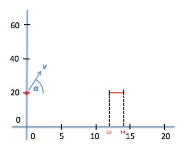
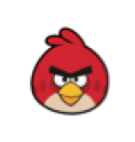

# Opgave 4: Angry Birds

We bekijken een situatie zoals in het plaatje hieronder getekend waarbij 
een bal wordt weggeschoten vanaf de positie (x=0, y=20) met snelheid 
$$v$$ onder een hoek ($$\alpha$$). Maak het programma `AngryBirds.py` 
aan waarin we gaan bestuderen welk pad de bal zal afleggen. Net as in de 
vorige opgaves zal dat gebeuren onder invloed van de zwaartekracht.

## vraag 4a): animatie stuiterende bal (functie)

Schrijf een functie die de beweging van de bal beschrijft en als mogelijkheid 
heeft om de beweging met behulp van een animatie op het scherm te tekenen. De
animatie geeft snel inzicht, maar is erg langzaam en wil je dus niet altijd doen.

  - Inputvariabelen:
    snelheid, hoek (in graden) en optie of er wel/geen animatie getoond moet worden  

Let op: als de bal de grond raakt zal hij weer omhoog stuiteren zonder 
daarbij energie te verliezen.

## vraag 4b): een druksensor

We voegen een extra element toe in het probleem; een druksensor die reageert als 
er een bal tegenaan botst. Dit kan zowel vanaf de bovenkant als de onderkant zijn. 
De druksensor bevindt zich op een hoogte $$y_{sensor}=20$$ en strekt zich uit van 
$$12 < x_{sensor} < 14$$ zoals getekend in onderstaande schets.

Schrijf een programma dat bestudeert welke hoeken zorgen dat de weggeschoten kogel 
de druksensor zal raken als het met een snelheid $$v=16$$ [m/s] wordt weggeschoten. 
Gebruik hiervoor de functie die je in vraag 4a gemaakt hebt. Varieer de hoek 
$$\alpha$$ tussen -88 en +88 graden in stappen van 1 graad en maak een grafiek waarin 
duidelijk wordt welke hoeken wel/niet voor een contact met de druksensor zorgen.

Tip bij deze opgave:

   - bepaal of je kan bepalen of de kogel door de lijn y=20 heengaat 
     ergens tussen x=12 en x=14.

   - zorg dat de functie die je in vraag 4a gemaakt hebt een return-value geeft 
     die weergeeft of de bal wel/niet de druksensor heeft geraakt
   

## Extra (optioneel):

De standaard manier om de positie van de kogel te tekenen die we in deze cursus 
geleerd hebben is de volgende:

    plt.plot(x_kogel, y_kogel, 'bo')  

Het is natuurlijk veel leuker om in plaats van een stipje een plaatje van een 
vogel te laten rondvliegen. Je hebt daar de volgende constructie voor nodig. 
Het stuk `plt.imshow` tekent het plaatje op het scherm. Je moet hierbij duidelijk 
het gebied aangeven waar het plaatje afgebeeld wordt. Hier is gekozen als 
positie die van de kogel en een afmeting van 0.5 in x en 2.0 in y respectievelijk.

    import matplotlib.image as image

    im = image.imread('/Users/ivo/Desktop/AngryBirdsLogo.png')
    plt.imshow(im, aspect='auto', extent=(x_kogel, x_kogel+0.5, y_kogel, y_kogel+2), zorder=-1)

