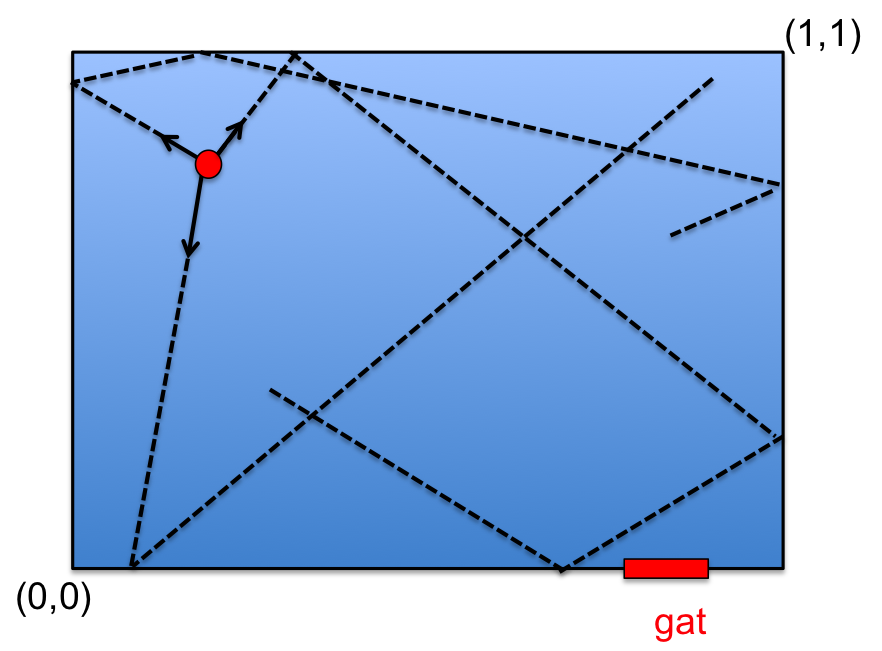

# Deeltjes in een doos

In een doos (afmeting $$0 \leq x \leq 1$$ en $$0 \leq y \leq 1) worden op een bepaalde plek ($$x_{bron}, y_{bron}) = (0,25;0,75) een aantal deeltjes weggeschoten in een willekeurige richting en snelheid. Voor elk deeltje $$i$$ geldt:

   - snelheid $$(v_{i}): 0 < v_{i} < 0.10$$
   - hoek $$(\alpha_{i}): 0 < \alpha_{i} < 2\pi$$
   

{: style="width:50%"}

We gaan in deze opdracht de positie van een groot aantal deeltjes volgen. Hoewel we in het begin de aanname zullen maken dat de deeltjes niet botsen (dat maakt de simulatie veel  makkelijker), zullen we aan het eind wat realisme toevoegen en de deeltjes laten botsen.

### Eerste opzet: niet-botsende deeltjes

Onze aannames in dit deel van de opdracht:

   1.  De deeltjes ketsen elastisch tegen de wanden en kunnen de doos niet uit

   2.  De deeltjes hebben geen afmeting en kunnen niet botsen

Algemene aanpak van de simulatie:

  - **stap 1: genereer een beginsituatie.**
  Elk deeltje wordt gekarakteriseerd door vier getallen: de x-positie (x), de y-positie (y) en de snelheid in de x-richting (vx) en de y-richting (vy). Maak daarom in het begin van je programma vier lijsten aan die de posities en snelheden van alle deeltjes bevatten.
  
**Tip:**
   - Als je in het begin de random snelheid en richting hebt gekozen voor het deeltje kan je die gelijk om schrijven in termen van vx en vy.
   - Hoewel het helemaal in het begin van het programma handig is om het pad van een deeltje te volgen (botst hij wel netjes terug van de wanden) is het **niet** handig om in je programma voor elk deeltje de positie en snelheid bij als functie van de tijd bij te houden. De vier lijsten bevatten gewoon de posities en snelheden op een gegeven moment. 

  - stap 2: ajsfc  
  

**Tip:**

algemeen: Genereer een beginsituatie voor een aantal deeltjes i en hou voor elk zijn
x-positie (x), y-positie (y), snelheid in de x-richting (vx) en die in de y-richting (vy)
bij.  Neem steeds stapjes
in de tijd en gebruik daarbij: xi+1 = xi + vi(x)t etc. Zelfde idee voor snelheden.

*Tip:*
Maak geen lijsten Sla niet voor Als je voor een enkel deeltjes

Maak niet een lijst 
Sla niet de po

a) Maak een graek van het aantal deeltjes aan de rechterkant van de doos
(xi > 0:5) als functie van de tijd.
b) Maak een graek van de gemiddelde afstand tussen de deeltjes als functie
van de tijd.
Stel nou dat er een gat in de doos zit (ygat = 0 en 0:8  xgat  0:9). Het is dan
mogelijk dat deeltjes uit de doos ontsnappen.
c) Maak een graek van het aantal deeltjes in de doos als functie van de tijd. Wat is
de gemiddelde tijd waarop de helft van de deeltjes uit de doos ontsnapt is: t1=2 ?
Probeer ook zonder computerprogramma een schatting te geven.
d) Stel nou dat de deeltjes gemiddeld met een 2x hogere hogere snelheid beginnen
(vi is random tussen 0 en 0.20). Maak weer dezelfde graek als bij c) en bepaal
opnieuw t1=2. Hoe verschilt deze van die bij c) ? Wat verwachtte je ?

## Stap 1: niet botsende deeltjes

Om iets te begrijpen van de wiskunde achter de fractals moeten we eerst een nieuw w

## Stap 2: botsingen en animeren

blabla

## Checkpy

Er is voor deze opdracht geen checkpy oplossing aanwezig. You're on your own.
