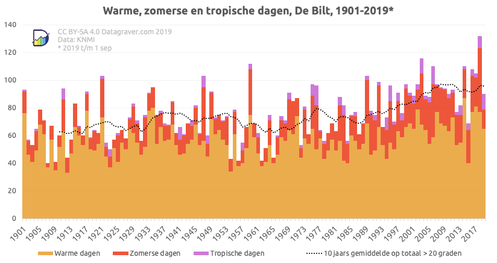

# Klimaatdiscussie

{:.inline}

Laten we een steentje bijdragen aan de klimaatdiscussie en data analyseren die  door de ECA (European Climate Assessment) [beschikbaar](http://eca.knmi.nl/dailydata/predefinedseries.php) wordt gemaakt in grote  data files. We beperken ons tot data die de maximum- en minimumtemperatuur beschrijft voor elke dag in De Bilt sinds 1901. 

De bestanden die respectievelijk de hoogste en laagste temperatuur in De Bilt voor elke dag weergeven:

- 
- 

Download de bestanden, open ze en lees bovenin hoe de data gecodeerd is. We zien dat de maximum(minimum)-temperatuur op 1 januari 1901 -2.4(-6.5) graden Celsius was.

> Let op! De datafiles bevatten ook allerlei uitleg. De bedoeling is dat je deze laat staan in het bestand. Je Python-programma moet zo geschreven zijn dat je deze regels netjes overslaat bij het verwerken!

Schrijf een programma **temperatuur.py** die de file regel voor regel inleest
en beantwoord de volgende vragen.

## Opdracht 1: extreme temperaturen

Schrijf een functie `ExtremeTemperatuur()` die de hoogste en laagste temperatuur vindt die in De Bilt is gemeten sinds het begin van de 20e eeuw. Zorg dat de functie de resultaten in een leesbaar formaat op het scherm print. Zeg dus niet: 

     Max 34.5 op 19670513

maar

     De hoogste temperatuur ooit gemeten in de Bilt is 34.5 graden Celcius. Dat gebeurde op 13 mei 1967.

Let op: 

 - Maak een aparte functie `Maand_als_string(i_maand)` die de naam van de maand in letters teruggeeft als string corresponderend met de maand in het jaar die als input variabele `i_maand` meegegeven wordt. Dus: `Maand_als_string(9) = "September"`.
 
 - geef de functie `ExtremeTemperatuur()` een inputparameter die de waarden -1 en +1 kan aannemen.   
   Zorg dat `ExtremeTemperatuur(1)` de hoogste temperatuur vindt en `ExtremeTemperatuur(-1)` de laagste.

## Opdracht 2: de kleine ijstijd

Maak een functie `Kleineijstijd()` die op zoek gaat naar de langste periode dat het aaneengesloten heeft gevroren (maximumtemperatuur onder 0◦C). Laat zien hoe lang deze periode duurde en geef ook aan wat de laatste dag was van deze periode
Meer expliciet: hoe lang (dagen) duurde deze periode en wat was de eerste en laatste dag van deze periode?  Zorg dat de output van je functie als volgt op het scherm wordt weergegeven:

     `De langste periode dat het aaneengesloten heeft gevroren duurde xxx dagen.`
     
     `Deze kleine ijstijd liep van <dag> <maand> <jaar> tot en met <dag> <maand> <jaar>.`

Gebruik bij het weergeven van de datum ook weer leesbare tekst door gebruik te maken van de functie `Maand_als_string()`
 die je eerder in opdracht 1 gemaakt hebt.

**Extra**: we hebben nu gekeken naar de periode waarbij de maximumtemperatuur niet boven het vriespunt uitkwam. Door de maximale temperatuur als parameter in je code te verwerken, een kleine aanpassing, kan je nu ook zoeken naar de periode dat de temperatuur niet boven de 30 graden uitkwam bijvoorbeeld.

 
## Opdracht 3: zomerse en tropische dagen

Het KNMI spreekt van een ***warme dag*** als de maximumtemperatuur minimaal 20 graden Celcius was en van een ***zomerse dag*** als de maximumtemperatuur meer dan 25 graden Celcius was. Op een ***tropische dag*** was het in de Bilt zelfs meer dan 30 graden. 

Schrijf een functie `ZomerseDagen()` die voor elk jaar, van 1901 tot en met 2018, het aantal warme, zomerse en tropische dagen als volgt op het scherm print:

    jaar  1980  warm =  69 , zomers =  12  en tropisch =  0
    jaar  1981  warm =  63 , zomers =  14  en tropisch =  0
    jaar  1982  warm =  88 , zomers =  32  en tropisch =  6
    jaar  1983  warm =  82 , zomers =  40  en tropisch =  7
    jaar  1984  warm =  56 , zomers =  16  en tropisch =  2
    jaar  1985  warm =  75 , zomers =  15  en tropisch =  1

Bij het analyseren van grotere data-sets is het erg belangrijk om de data ook te 
visualiseren. 

{:.inline} 
Een van de mensen die met grote regelmaat grafieken maakt en deelt 
over dezelfde data-set die wij in deze opdracht analyseren is 
Stephan Okhuijsen. Op 1 september 2019 plaatste hij in een tweet onderstaande grafiek waarbij hij de het aantal warme, zomerse en tropische dagen laat zien voor elk jaar vanaf 1901 tot en met 2018. 

**Optioneel**: Met alle Python kennis die we hebben opgedaan zouden we deze grafiek nu ook zelf moeten kunnen maken. Je moet dan wel even zelf op zoek naar de manier om een zogenaamd 'stacked' histogram te maken in Matplotlib. Gebruik in dit geval de documentatie van matplotlib zelf [hier](https://matplotlib.org/3.1.1/gallery/statistics/histogram_multihist.html) of doe wat de meeste van ons doen en Google gewoon en vind het [antwoord](https://www.weirdgeek.com/2018/11/plotting-stacked-histogram/)
 dat anderen met dezelfde vraag al hebben uitgevogeld. Geen extra punten voor deze vraag, maar wel een goed gevoel natuurlijk als het je lukt.

## Opdracht 4: Jaren met een dubbele hittegolf

We spreken in Nederland van een ***hittegolf*** als de maximumtemperatuur ten minste vijf dagen achtereen minstens 25,0°C was (zomerse dagen) waarvan ten minste op drie dagen 30,0°C of meer (tropische dagen). Schrijf als eerste stap in deze opdracht een functie `Hittegolf()` die net als in opdracht 3 het aantal zomerse en tropische dagen vermeldt, maar daarnaast ook het aantal hittegolven:

    jaar  1980  warm =  69 , zomers =  12  en tropisch =  0  en hittegolven = 0
    jaar  1981  warm =  63 , zomers =  14  en tropisch =  0  en hittegolven = 0

Het is handig om te beginnen met de code uit opdracht 3.

In 2019 hadden we zelfs een dubbele hittegolf, iets dat blijkbaar maar een paar keer eerder had plaatsgevonden. We gaan in deze opdracht zelf uitzoeken hoe zeldzaam dat is. Zorg dat je programma aan het eind ook een lijstje print van de jaren waarin er een dubbele (of misschien zelfs een driedubbele hittegolf) is geweest. Doe dat in het volgende format:

    De jaren waarin er minimaal meerdere hittegolven zijn geweest zijn:
      - In het jaar <jaar> waren er <aantal> hittegolven
      - In het jaar <jaar> waren er <aantal> hittegolven
      - ...

## Nette code en nette uitvoer

Zorg dat de code van alle opdrachten in een functie of in functies staat. Gebruik geen globale variabelen (vraag indien nodig wat dit is)!
