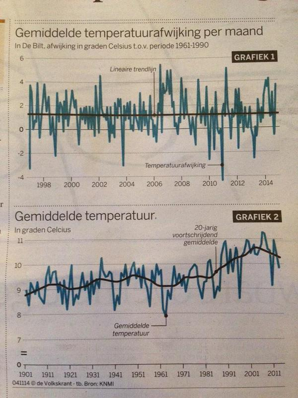

# Checken grafieken in de krant & zelf data verzamelen

## Deel 1: checken grafieken in de krant

In de opdrachten van deze module hebben we de data die het KNMI heeft verzameld geanalyseerd. In dit geval was dat de maximum en temperatuur per dag in de 20$$^{ste}$$ eeuw in De Bilt, maar er zijn natuurlijk enorm veel data-sets. Deze data is de basis voor verschillende studies waarin mensen trends en patronen proberen te ontdekken. Ook overal in de media komen verschillende visualisaties terug als illustraties bij artikelen. Met de kennis die we in deze module opgedaan hebben kunnen we nagaan of dat wel netjes gebeurd is.

##### Opdracht 1: illustratie in de Volkskrant

{: style="width:50%"}{:.inline}

In de Volkskrant van 3 november 2014 verschenen de grafieken zoals hier rechts staan. 
Schrijf een programma `volkskrant.py` die, met de data van de KNMI uit deze module, de grafiek reproduceert. En, klopt het een beetje?

## Deel 2: zelf data verzamelen en visualiseren

In de eerste opdracht van deze module

##### Opdracht 2: zelf data vezamelen
