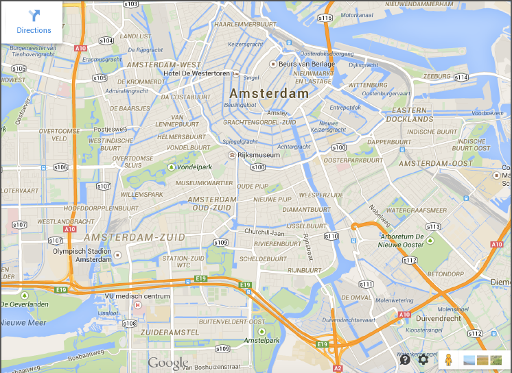

# Opzet en doel Module 4

Een veel voorkomende toepassing van computerprogramma’s is het inlezen en ver- werken van grote data bestanden. We zullen in Module 4 een korte toepassing bekijken hiervan.

a) lezen file:

	input_filehandle = open(’inputfile.txt’, ’r’)
	for line in input_filehandle:
        print line
	input_filehandle.close()

Toegang tot de verschillende parameters in de regel krijg je door de regel in stukken te ’knippen’, bijvoorbeeld met behulp van het `split` commando. Het commando elementen = `line.split()` produceert een lijst met elementen die de losse stukken bevatten. Hierop kan je afzonderlijke bewerkingen uitvoeren.

b) inlezen en uitschrijven file:

	input_filehandle = open(’inputfile.txt’, ’r’)
	output_filehandle = open(’outputfile.txt’, ’w’)
	for line in input_filehandle:
        newline = line + " XXXX"
        output_filehandle.write(newline)
    input_filehandle.close()
    output_filehandle.close()
    
    
# Opgave 1: Sensor Data 
    
Een iPhone bevat veel delicate sensoren die informatie verzamelen over de 
positie, snelheid, versnelling. We hebben gedurende een korte auto-rit de 
data opgeslagen en in een file weggeschreven met een frequentie van 1 [Hz]. 
De sensor data is beschikbaar in de file `AutoRitData.csv` en is te downloaden 
vanaf de volgende website: 

ascs [abc](http://www.nikhef.nl/~ivov/Python/SensorData/ "hoihoi")

sacLKN [def](http://www.nikhef.nl/~ivov/Python/SensorData/)
ad

Bovenin de file staat kort welke informatie elk veld bevat.}}
\end{minipage}
~~~~~~~~~
\begin{minipage}{7.0cm}
 \begin{center}
   \includegraphics[width=7.0cm]{Amsterdam.pdf}
~~\\
 \end{center}
\end{minipage}
\end{figure}

Het verzamelen van de data begon toen de auto zich bevond op de plek waar de snelweg A4 op de A10 aansluit. Het verzamelen van de data stopte toen de auto op het Nikhef was aangekomen. Schrijf een programma dat de file doorloopt en beantwoord de volgende vragen. \\

{\bf a) afstand}\\
Maak een grafiek van de snelheid van de auto (in km/uur) als functie van de tijd en gebruik de data om een schatting te maken van de totaal afgelegde weg.\\
~~\\
{\bf b) route (niet verplicht)}\\
Maak een grafiek van de positie van de auto en kleur de route groen(rood) op de stukken van de route waar de snelheid van de auto groter(kleiner) was dan 50 km/uur.
~~\\
~~\\
%\framebox{  \minibox{  
%{\bf hacker edition:}  Vraag a),  maar nu alleen met behulp van de versnellings-data.\\
%}}

