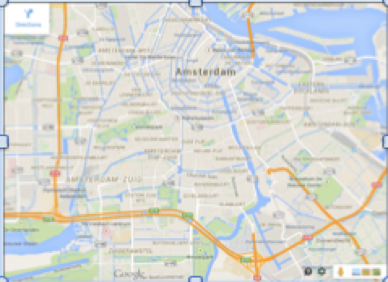

# Opzet en doel Module 4

Een veel voorkomende toepassing van computerprogramma’s is het inlezen, verwerken 
en analyseren van grote data bestanden. Big data! We zullen in Module 4 een leren 
hoe we data inlezen en gebruiken onze kennis van Python om de data te rubriceren en 
te grafieken te maken van onze resultaten.

# Inlezen files en verwerken van de data

Net zoals je getallen in het decimale, hexadecimale of binaire formaat weer kan geven
wordt ook data in verschillende formaten bewaard in data-bases. Hier zullen we data
bekijken die is opgeslagen in het zogenaamde CSV formaat (comma separate values): 
'platte tekst', waarbij op elke regel verschillende variabelen gescheiden zijn door 
een komma. 

We gaan het inlezen en verwerken van data doen aan de hand van een voorbeeld: 
de statistieken van Marco van Basten. Iemand heeft in een file bijgehouden 
hoeveel wedstrijden hij gespeeld heeft en hoeveel doelpunten hij gemaakt heeft.

De file VanBasten.txt:

    198182, Ajax, 1, 1	
    198283, Ajax, 20, 9	
    198384, Ajax, 26, 28	
    198485, Ajax, 33, 22	
    198586, Ajax, 26, 37	
    198687, Ajax, 27, 31	
    198788, AC Milan, 11, 3	
    198889, AC Milan, 33, 19	
    198990, AC Milan, 26, 19	
    199091, AC Milan, 31, 11	
    199192, AC Milan, 31, 25	
    199293, AC Milan, 15, 13	
    199394, AC Milan, 0, 0	
    199495, AC Milan, 0, 0	

Het doel van het voorbeeld is op op het scherm te printen:
   - de seizoenen waarin Van Basten meer dan 20 keer gescoord heeft
   - het totaal aantal doelpunten te berekenen die Van Baste voor zijn clubs heeft gescoord.
    
## Stap 1: openen van de file, inlezen van de regels

Omdat het doorlopen van files in een computertaal een standaard procedure is 
zijn er een aantal gemakkelijke commando's beschikbaar. De volgende code opent 
de file en gebruikt een for-loop om steeds de volgende regel in te lezen. De 
informatie in een regel van de file wordt opgeslagen in de variable `line` (die 
kan je elke naam geven die je wilt trouwens). Dit korte programma doet niks met 
de regel en print alleen `line` naar het scherm. 

	input_filehandle = open('/Users/ivo/Desktop/VanBasten.txt', 'r')
	for line in input_filehandle:
        print line
	input_filehandle.close()

Als je dit programma uitvoert zal je zien dat bijvoorbeeld de regel van 1988 zo op 
het scherm verschijnt:

    198889, AC Milan, 33, 19 

## Stap 2: splitsen van de regel en in een lijst opslaan

Elke regel bestaat uit verschillende elementen die Toegang tot de verschillende 
parameters in de regel krijg je door de regel in stukken te ’knippen’. Dit doe je 
met het Python commando `split()`. Als parameter kan je aan split meegeven waar 
hij moet knippen. Wij willen dat hij bij elke komma (`,`) knipt, dus we voeren 
het volgende commando uit: `line.split(',')`. Dit commando produceert een lijst 
met elementen die de losse stukken bevatten. Hierop kan je afzonderlijke bewerkingen 
uitvoeren.

	input_filehandle = open('/Users/ivo/Desktop/VanBasten.txt', 'r')
	for line in input_filehandle:
        print line
        data_opgeknipt = line.split(',')
        print data_opgeknipt
   	input_filehandle.close()

De regel met 1988 is nu in stukken geknipt en de Python-lis 
    ['198889', ' AC Milan', ' 33', ' 19\t\n']

## Stap 3: opslaan van de informatie in variabelen

In deze opgave zijn we alleen geinteresseerd in het jaar en het aantal doelpunten. 
Zoals je ziet is die informatie opgeslagen in respectievelijk element 0 en 2 van 
de lijst.

Die informatie kunnen we nu dus opslaan in een variabele:

    seizoen = data_opgeknipt[0]
    doelpunten = data_opgeknipt[2]

### subtiliteit 1: uitpakken variabelen
Zoals je ziet hebben de makers van de file het seizoen 1988-1889 in 1 getal 
weergegeven: 198889. Slim van ze, maar wij zijn alleen geinteresseerd in het 
jaar dat het seizoen is gestart. Dat is verpakt in de eerst 4 karakters. Om 
alleen die op te vragen kan je dus van element 0 in de lijst `data_opgeknipt` 
alleen de eerste 4 karakters selecteren.

    seizoen = data_opgeknipt[0][0:4]
    doelpunten = data_opgeknipt[2]

### subtiliteit 2: getallen versus woorden

De regel wordt ingelezen als tekst. Zodra je met het `split()` commando de regel 
in stukken hebt geknipt zijn elk van die delen stukken *tekst*. De computer ziet 
het dus nog niet als een *getal*. Om te zorgen dat het jaartal en het aantal 
doelpunten ook echt een getal worden moet je ze expliciet van tekst omzetten 
naar een getal.

    seizoen = float(data_opgeknipt[0][0:4])
    doelpunten = float(data_opgeknipt[2])

Je hebt nu dus de informatie tot je beschikking en nu kan je met de Python 
bouwstenen die je eerder in deze cursus hebt verkregen de data manipuleren.

## Stap 4: het analyseren van de data

We wilden het aantal totaal aantal doelpunten uitreken dat Van Basten voor zijn 
clubs heeft gescoord en ook aangeven in welke seizoenen hij meer dan 20 doelpunten 
maakte.

	input_filehandle = open('/Users/ivo/Desktop/VanBasten.txt', 'r')

    Ndoelpunten_tot = 0
	for line in input_filehandle:
        data_opgeknipt = line.split(',')
        
        seizoen = float(data_opgeknipt[0][0:4])
        doelpunten = float(data_opgeknipt[2])

        Ndoelpunten_tot = Ndoelpunten_tot + doelpunten   

        if(doelpunten > 20) :
           print "In het seizoen %d scoorde Van Basten meer dan 20 doelpunten, nl %d" % (seizoen, doelpunten)

    print "TOTAAL: In zijn hele carriere scoorde Van Basten %d clubdoelpunten" % (Ndoelpunten_tot)
   	input_filehandle.close()
    

b) inlezen en uitschrijven file:

	input_filehandle = open(’inputfile.txt’, ’r’)
	output_filehandle = open(’outputfile.txt’, ’w’)
	for line in input_filehandle:
        newline = line + " XXXX"
        output_filehandle.write(newline)
    input_filehandle.close()
    output_filehandle.close()

    

    
    
# Opgave 1: Sensor Data 
    
Een iPhone bevat veel delicate sensoren die informatie verzamelen over de 
positie, snelheid, versnelling. We hebben gedurende een korte auto-rit de 
data opgeslagen en in een file weggeschreven met een frequentie van 1 [Hz]. 

De sensor data is beschikbaar in de file `AutoRitData.csv` en is te downloaden 
via de volgende link:

Data-file: [AutoRitData.csv](http://www.nikhef.nl/~ivov/Python/SensorData/AutoRitData.csv)

Bovenin de file staat kort welke informatie elk veld bevat.

Het verzamelen van de data begon toen de auto zich bevond op de plek waar de 
snelweg A4 op de A10 aansluit. Het verzamelen van de data stopte toen de auto 
op het Nikhef was aangekomen. Schrijf een programma `Autorit.py` dat de file 
doorloopt, de data verwerkt en beantwoord de volgende vragen.

## Vraag 1a) afgelegde afstand
Maak een grafiek van de snelheid van de auto (in km/uur) als functie van de 
tijd en gebruik de data om een schatting te maken van de totaal afgelegde weg.

## Vraag 1b) teken de afgelegde route
Maak een grafiek van de positie van de auto en kleur de route groen (rood) 
op de stukken van de route waar de snelheid van de auto meer (minder) 
was dan 50 km/uur.

