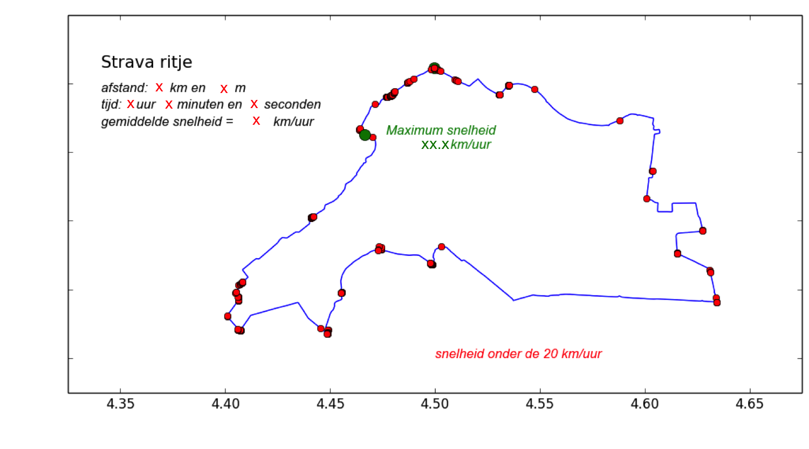
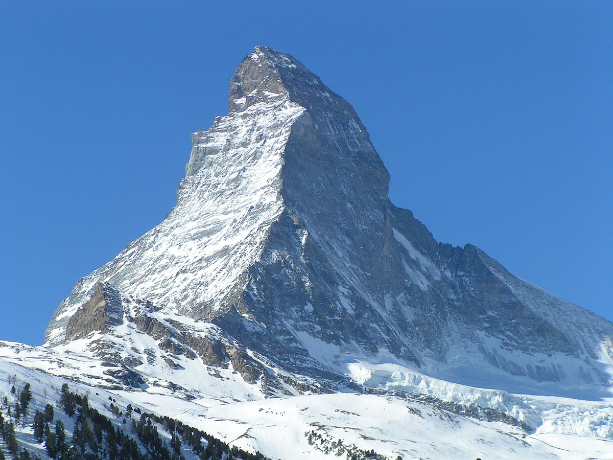

# Opdracht: sensordata verwerken  

{:.inline}{: style="width:8%"}

Een mobiele telefoon bevat sensoren om informatie over positie, snelheid en versnelling vast 
te leggen. Deze data wordt natuurlijk voor navigatie gebruikt, maar ook in veel apps die 
voor sport gebruikt worden. In deze opdracht gaan we aan de slag met de data die verzameld 
is door een app die door veel wielrenners gebruikt wordt: [Strava](http://www.strava.com). 
Na het sporten kan je in 
detail je rit terugkijken: de projectie van de route op een interactieve kaart, de gemiddelde 
snelheid, het hoogteprofiel, records op vooraf gedefiniëerde stukken weg en nog veel meer. 
We gaan in deze opgave zelf deze informatie uit de sensor-data halen en, niet verder vertellen, 
proberen de data in de file te manipuleren: digitale doping.

Onze data is verzameld tijdens een echte fietsrit die een natuurkundige aan de Universiteit 
van Amsterdam samen met zijn buurman maakte ergens in de buurt van Leiden. Het bestand met 
de gegevens over de rit zoals die door de app is verzameld is hier te downloaden: 
[FietsRitData.gpx](FietsRitData.gpx).

De eerste regels van de file bevatten wat algemene tekstuele informatie, maar daarna wordt 
het interessant. Elk meetpunt (ongeveer om de seconde) worden drie zaken vastgelegd: positie, 
hoogte en het tijdstip. Dit is voldoende informatie. In het plaatje hieronder zie je een 
kleine preview van de eerste drie meetpunten die in de file te vinden zijn:

{: style="width:40%"}

Als je de structuur bekijkt zie je dat de informatie van elke meting in drie regels wordt 
weggeschreven:

	1) lokatie: lengte- en breedtegraad 
	2) hoogte
	3) datum en tijd

We gaan in deze opgave stap voor stap een programma `Strava.py` schrijven dat de data inleest, 
decodeert, opslaat in afzonderlijke lijsten en vragen over de rit beantwoordt. We doen dat 
aan de hand van de onderstaande opdrachten.

## Opdracht 1: teken de route op het scherm

Maak een functie `Fietsrit()` die de file opent, alle metingen doorloopt en de locaties van 
alle meetpunten opslaat in twee lijsten: de latitude en de longitude. Gebruik deze informatie 
om de route op het scherm te tekenen. 

Een paar extra randvoorwaarden voor het tekenen van de grafiek:

    - Let op de juiste oriëntatie (ivm mogelijke projectie op een kaart)
	- Geef het beginpunt aan met een grote groene stip en het eindpunt met een kleine gele 
	- Verderop in de opgave gaan we nog wat extra informatie toevoegen op het scherm. Hou 
	  dus iets ruimte over bij het tekenen van de grafiek 

### Computing tip:

Tijdens het inlezen van elke regel kan je een test uitvoeren of er een bepaalde 'string' in 
de regel voorkomt. In ons geval weten we bijvoorbeeld dat als we de string *"<trkpt"* tegenkomen 
we de regel te pakken hebben waarin de locatie opgeslagen staat. Maar met het herkennen van 
de regel ben je er nog niet natuurlijk. Je moet daarna namelijk nog wel de informatie over de 
latitude en longitude (die altijd op dezelfde positie in de string staan) uit de string 'knippen'. 

       if "<trkpt" in line: 
           latitude = ....
           longitude = ....

**Let op:** 
Zodra je het stukje regel hebt herkend waar de latitude en longitude is opgeslagen ziet
de computer dit nog steeds als tekst en niet als getal. Gebruik de functie `float()` om 
dat stukje van de regel om te zetten in een getal voor je het opslaat in de lijst. Zo 
kan je er verderop in het programma mee rekenen.

## Opdracht 2: totaal afgelegde afstand en snelheidsgrafiek

Bereken de totaal afgelegde afstand tijdens de fietsrit, de gemiddelde snelheid en maak een 
grafiek van de snelheid als functie van de tijd, waarbij de tijd weergegeven is als het 
aantal seconden na het begin van de rit. 

Laat je programma de volgende samenvatting van de rit printen (in dit format):

	Rit: duur van de rit was x uur, y minuten en z seconden
	Rit: afgelegde weg was x.x km
	Rit: gemiddelde snelheid was xx.x km/uur
	Rit: maximum snelheid was xx.x km/uur en werd gereden x seconde na de start van de rit
        
Dit is een opdracht die verschillende nieuwe componenten bevat en daarom gebaat is bij een 
aanpak waarbij je het in kleinere stappen opdeelt. Bedenk je plan *voor* je computercode 
gaat schrijven. In dit geval zou je bijvoorbeeld de volgende stappen kunnen volgen om het 
probleem gestructureerd aan te pakken.
        
### Stappenplan:

	- stap 1: maak de lijst met meettijden (in seconden na het begin van de rit)

Als je de regel met de tijdstippen hebt gedecodeerd (uur, minuten en seconden) is het handig 
om die om te rekenen naar een aantal seconden sinds het begin van de dag. Dit maakt het 
namelijk eenvoudig om het tijdsverschil tussen twee willekeurige meetmomenten te berekenen. 
Het is ook handig om het eerste meetmoment te definiëren als t=0 zodat je elk tijdstip 
om kan rekenen naar het tijdsverschil ten opzichte van dat meetpunt voor je het in een 
lijst opslaat.

    - stap 2: maak de lijst met snelheden 

Zodra je vanuit de data-file alle posities en tijden hebt ingelezen kan je de file sluiten. 
Je hebt dan immers alle informatie die je nodig hebt om de afgeleide informatie zelf te 
berekenen zoals de totale afgelegde weg en de lijst met snelheden op elk tijdstip. Immers, 
als we bij meetpunt *i* zijn aangekomen weten we zowel de afgelegde weg (verschil in positie) 
als het tijdsverschil tussen dit meetpunt en het vorige meetpunt (*i-1*). En daarmee dus 
ook de snelheid die de fietser had tijdens dit kleine stukje van de route. Bereken op deze 
manier de snelheid op elk tijdstip en sla deze informatie op in een lijst.

**Let op:** 
De fietser stond stil op t=0. Het eerste element in de lijst met snelheden is dus 0.

    - stap 3: de lijst met afgelegde afstanden

Tijdens het doorlopen van de meetpunten om de snelheidslijst te vullen kan je natuurlijk 
ook gelijk de totale (tot nu toe) afgelegde weg bijhouden in een lijst. Ook deze lijst 
begint natuurlijk met 0 afgelegde kilometers op t=0.

Een paar extra randvoorwaarden bij het tekenen van de snelheidsgrafiek:

	- Geef met een groene stip aan waar de maximale snelheid werd bereikt 
	  ... en geef die snelheid ook weer als tekst
	- Teken met een stippellijn de gemiddelde snelheid
	  ... en geef die snelheid ook weer als tekst 

        
## Opdracht 3: afgelegde route met extra informatie

Teken opnieuw de grafiek van de afgelegde route (net als in opdracht 1), maar voeg nu wat extra 
elementen toe:

	- rit-karakteristieken als tekst in de grafiek: 
	  duur van de rit, afgelegde weg en gemiddelde snelheid
	- maximale snelheid: groene stip op plek waar die werd behaald en in tekst
	- rode bolletjes waar de snelheid lager was dan 20 km/uur

{: style="width:80%"}

Laat je programma ook berekenen hoe lang er onder de 20 kilometer per uur gereden. 
Print deze informatie op het scherm in de volgende format:

	 Er is gedurende x seconden langzamer gereden dan 20 km/uur
	
## Opdracht 4: Fake data: Nederlandse col van de buitencategorie

Oud wielrenner Thijs Zonneveld lanceerde een paar jaar geleden het idee om een berg in Nederland te 
maken. Geen grap, kijk maar naar deze Youtube clip: 
[Die berg komt er!](https://www.youtube.com/embed/MVyWMS1Jj6M)

{:.inline}{: style="width:40%"}

Om te kijken hoe dat er op een Strava profiel uit zou zien en om zijn buurman in één klap voorbij 
te gaan in hun hoogtemeters-in-dit-kalenderjaar klassement besluit de natuurkundige de data van 
zijn rit zo te manipuleren dat het lijkt of hij inderdaad een berg zo hoog als de Matterhorn (4478 m) 
heeft geklommen tijdens hun zondagse ritje. 

Deze opdracht bestaat uit twee stappen. Eerst een grafiek leren maken van het hoogteprofiel van 
een rit en daarna een nieuwe data-file maken waarin de hoogte van de meetpunten is gemanipuleerd. 

 
### Opdracht 4a: hoogteprofiel

Naast de locatie en de tijd is ook de hoogte opgeslagen op elk meetpunt. Sla ook die data op en teken 
de grafiek van de hoogte als functie van de tijd (weer in seconden sinds het begin van de rit). 

### Computing tip:
**Let op:** het kan erg verleidelijk zijn om op basis van de eerste paar regels in de data-file te 
concluderen dat de hoogte tijdens een rit is opgeslagen in een deel van de regel die maar drie karakters 
breed is (X.Y) en dat dat correspondeert met X meter en Y decimeter boven of onder zeeniveau. Nou 
klopt het dat je rond Leiden nooit boven tien meter boven of onder zeeniveau uitkomt, maar als je 
op elke andere plek in de wereld gaat fietsen zal de hoogte ook best tussen de -20 en +2500 kunnen 
liggen. Hoewel je niet van tevoren weet hoeveel karakters er gebruikt zijn om de hoogte weer te geven 
weet je wel op welke plek in de regel de waarde begint (hoeveel karakters er dus *voor* de hoogte staan) 
en ook hoeveel karakters er *achter* de hoogte staan in de regel. Met een iets algemenere formulering 
ben je zo (flexibel) om de hoogte uit de regel te peuteren:

	   dus niet:   hoogte = float( line[9:12] )
       maar wel:   hoogte = float( line[9:len(line)-7] )

Zorg dat in bovenstaande syntax goed begrijpt welke letters er van de regel geselecteerd worden.
	
{:.inline}{: style="width:40%"}

### Opdracht 4b: creëer de fake data-set

Maak een nieuwe data-file `Matterhorn.gpx` die bijna identiek is aan de originale `FietsRitData.gpx` 
en die alleen verschilt in de regels die de hoogte aangeven. 

De taak is dus om regel voor regel de originele file in te lezen en die weer gelijk weg te schrijven 
in de nieuwe file. Alleen voor de regels waar de hoogte is aangegeven moeten voor het wegschrijven de 
oorspronkelijke hoogte vervangen door een die we zelf bedacht hebben. Het doel is dat het volgende 
hoogte-profiel ontstaat in de rit:

	- eerste kwart: zeeniveau (h=0)
	- tweede kwart: lineair stijgen tot h=4478 m
	- derde kwart:  lineair dalen tot h=0 m
	- vierde kwart: zeeniveau (h=0)
		
### Computing tip:

	- Volg het voorbeeld in het begin van de module om te hebben we gezien hoe je een file kan aanmaken en 
er een regel in weg kan schrijven.  
	- gebruik de code die je in opdracht 4a geschreven hebt om te verifiëren of het hoogteprofiel inderdaad
	  correct in de file is weggeschreven.

# Extra opdrachten (niet verplicht)

## Opdracht 5: snelste en langzaamste stukken van de rit

We kunnen de data in meer detail bekijken, Twee van de vele vragen die we kunnen stellen zijn 
die hieronder in vraag 5a en 5b zijn gesteld.

### Opdracht 5a: de langste en kortste afstand afgelegd *in een minuut*

Loop door de verzamelde data heen en zoek de minuut waarin de grootste en de langzaamste afstand is 
afgelegd. Hiermee weet je gedurende welke minuut er het respectievelijk het snelst en het langzaamst 
is gereden. Print deze data op het scherm:

	 Minuut: snelst  => afstand = x.xx m, gemiddelde snelheid = x.xx m/s
	 Minuut: traagst => afstand = x.xx m, gemiddelde snelheid = x.xx m/s

*Let op:*
Niet elke tijdstap tussen twee metingen is precies een seconde.

### Opdracht 5b: de langste en kortste afstand afgelegd *in een kilometer*

Loop door de verzamelde data heen en zoek de kilometer die in het kortste en het langste tijdsinterval is 
afgelegd. Hiermee weet je gedurende welke kilometer er het respectievelijk het snelst en het langzaamst 
is gereden. Print deze data op het scherm:

	 Kilometer: snelst  => tijdsduur = x s, gemiddelde snelheid = x.xx m/s
	 Kilometer: traagst => tijdsduur = x s, gemiddelde snelheid = x.xx m/s

**Let op:**
Niet elke tijdsverschil tussen twee metingen is precies een seconde.

## Opdracht 6: digital epo en het eeuwige kat-en-muisspel

Dit is niet een opdracht waarin je iets moet uitrekenen, maar waarin je alleen na hoeft te denken.

In opdracht 4 hebben we gezien hoe we de data kunnen manipuleren zodat het lijkt of we een enorme 
berg hebben bedwongen in een polderlandschap. Dat hebben we natuurlijk op een knullige manier 
gedaan, maar je kan je voorstellen dat je dat ook op een meer geraffineerde manier doet.

Sterker nog, Er is een site waarop wielrenners hun prestaties digitaal kunnen verbeteren 
voor ze hem uploaden naar Strava: [digital epo](http://digitalepo.com/).

Schande natuurlijk, maar als we het bekijken vanuit onze cursus dan wordt het wel weer 
interessant omdat het goed laat zien dat programmeren heel vaak zo veel meer is dan 'allen' 
programmeren. In dit geval bijvoorbeeld creativiteit, mensenkennis en politiek.

Laten we eerst eens bedenken hoe we het zelf zouden doen:

	- Hoe moet je de file veranderen zodat het lijkt of je 5% sneller bent geweest?

Je hoeft het niet te implementeren in de code (mag wel natuurlijk), maar beschrijf 
hoe je te werk zou gaan. Wat is je algemene strategie en wat zijn de grootste problemen 
die je ziet opduiken? 

Het probleem vanaf de andere kant bekijken is minstens zo interessant:

	- Hoe zou je kunnen achterhalen of een file gemanipuleerd is?

Elk antwoord dat je hierboven opschrijft zou je natuurlijk ook weer kunnen gebruiken om 
de data op een gerafiniëerde manier te manipuleren zodat al deze tests negatief terugkomen. 
Het is het bekende kat-en-muisspel bij doping in de sport. Nu ook met digitale doping dus.
	

