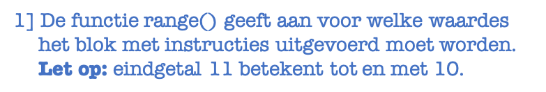

# Loops

Het komt heel vaak voor dat je een aantal instructies een groot aantal keer wilt uitvoeren. De manier om dat te sturen is met behulp van loops. Op deze pagina vind je uitleg en vooral ook een aantal voorbeelden van waar loops nuttig voor kunnen zijn.

Maak een bestand `loops_oefenen.py` en implementeer daarin de onderstaande voorbeelden en de opdrachten.

## Loops voor herhaling

Een `for`-loop gebruik je als je een aantal instructies wilt herhalen. Als je bijvoorbeeld op het scherm de waardes van de getallen 1 tot en met 10 wilt printen kun je dat natuurlijk met tien afzonderlijke print statements doen, maar het kan ook als volgt:

    for x in range(1, 11):
        print("x heeft nu de waarde ",x)
    
Dit programma heeft namelijk als output

    x heeft nu de waarde 1
    x heeft nu de waarde 2
    x heeft nu de waarde 3
    ...
    x heeft nu de waarde 10

De loop begint door de waarde van x op 1 te zetten en gaat vervolgens *alle* instructies uitvoeren die in de loop staan. Daarna wordt aan x de waarde 2 toegekend en worden opnieuw alle instructies uitgevoerd. Op dit moment is er maar een enkele instructie, namelijk: print de waarde van het getal, maar dat kunnen we natuurlijk uitbreiden. Belangrijkste is dus dat het programma automatisch de variabele `x` aanpast. 

{: style="max-width:500px;"}

Er zijn een paar belangrijke dingen om te noemen:

-   **Let op:** dat Python telt *tot* het eindgetal in de functie range(): range(1,11) loopt dus van 1 *tot en met* 10. Dit is een veelgemaakte fout als je begint te programmeren in Python. Het voelt onlogisch, maar that's just the way it is.

-   In het bovensteende voorbeeld hebben we de variabale die verandert de naam 'x' gegeven, maar je had natuurlijk ook 'getal', 'i' of 'teller' kunnen gebruiken. Wat jij zelf handig vindt.

-   Je kunt met range ook de stapgrootte opgeven. Standaard neemt hij stapjes van 1, maar als je stapjes van 10 wilt nemen gebruik je de volgende syntax:
    
         for x in range (1,100, 10):
    
    Probeer dit zelf eens uit zodat je goed weet welke waardes x aanneemt.

## Soorten loops

Er zijn in Python, net als in bijna elke programmeertaal, twee standaard constructies om te loopen: de **for-loop** en de **while-loop**. 

Een for-loop gebruik je als je precies weet hoe vaak je een instructie uit wilt/moet voeren. In gevallen waar je dat niet weet, en bij elke stap wilt kunnen besluiten of je nog verder gaat tellen, gebruik je een while-loop. Net zoals bij de for-loop worden alle instructies in het blok uitgevoerd voor een bepaalde waarde van de variabele. Daarna wordt geëvalueerd of het nogmaals uitgevoerd moet worden. While betekent immers 'zolang als'.

In feite zijn `for` en `while` ook uitwisselbaar. Deze for-loop:

	    for x in range(100):
	        print("x heeft nu de waarde ", x)

is gelijk aan de volgende `while`-loop:

	    x = 0
	    while x < 100:
	        print("x heeft nu de waarde ", x)
	        x = x + 1

De `for`-loop is duidelijk wat compacter en zo sneller leesbaar. Dat is dus ook de loop die het meest gebruikt wordt. Maar toepassingen zoals gebruikersinvoer kun je eigenlijk alleen maar met een `while`-loop schrijven, dus deze heeft ook z'n nut.

## Rekenen met hulp van loops

In het eerste voorbeeld hadden we maar één instructie in de loop zelf, namelijk 'print de waarde van x op het scherm', maar je kunt ook meer instructies laten uitvoeren voor elke waarde die x aanneemt.

In onderstaande voorbeeld tellen we de waarde van x steeds op bij een variabele die we aan het begin van het programma op nul hebben gezet. Aan het eind van het programma bevat die variabele dan de som van alle getallen van 1 tot en met 10. Het is daarna een peulenschil om met een kleine aanpassing de som van 1 tot en met 712643 op te tellen in plaats van 1 tot en met 10.

Zodra alle instructies zijn uitgevoerd voor de hoogste waarde die x kan aannemen is de loop 'afgelopen' en gaat het programma gewoon verder. In dit geval laten we het programma de som van alle getallen printen op het scherm. Let ook goed op de indentatie van de laatste regel. 

    som = 0 
    for x in range(1, 11):
        print("x heeft nu de waarde ",x)
        som = som + x

    print("De som van de getallen van ", 1, " tot en met ", 10 = ", som)

**Oefening 1:** Pas bovenstaand programma eens aan door het laatste print-statement verder in te laten springen tot het precies onder de regel 'som = som + x' staat. Run het programma en probeer te begrijpen wat er gebeurt. Dit is een veelgemaakte fout met loops dus belangrijk om deze 'fout' een keer te zien zodat je het later goed herkent.

**Oefening 2:** Op dit moment gaat het om de getallen van 1 tot en met 10. Probeer bovenstaand programma om te schrijven door op één plek bovenin het programma dit maximale getal te definiëren.

**Oefening 3:** Maak een programma dat dezelfde werking heeft, maar gebruik nu de while-loop in plaats van de for-loop. 

**Oefening 4:** Gebruik een while-loop om te zorgen dat het programma getallen blijft printen (ook tot boven de 10), maar stopt als de som van de getallen groter is dan 123.

## Filteren met hulp van loops

Je kunt in het blok instructies binnen een loop ook gebruikmaken van conditionals.

Als je bijvoorbeeld de loop wilt laten lopen van 1 tot en met 20 en alleen de getallen groter dan 15 en de getallen die deelbaar zijn door 3 wilt printen dan kan je dat als volgt doen.

    for getal in range(1, 20):
        if getal > 15:
		   print("Dit getal is groter dan 15, namelijk ", getal)
        if getal % 3:
		   print("Dit getal is precies deelbaar door 3, -> ", getal)

We hebben al eerder verteld dat je de naam van je variabele zelf mag bepalen. Zoals jullie zien hebben we in bovenstaand programma 'x' vervangen door de naam 'getal'.

**Oefening 5:** Pas bovenstaand programma zo aan dat aan het eind van het programma op het scherm geprint wordt hoeveel getallen er precies deelbaar waren door 3. Je zult hiervoor een zogemaande 'teller' bij moeten houden. Een variabele die aan het begin van het programma op 0 wordt gezet steeds met 1 opgehoogd wordt zodra je een 'goede' gevonden hebt. Besteed ook aandacht aan het format van de output; laat je programma het als volgt printen:

    Van de getallen 1 tot en met 20 zijn er precies ... deelbaar door 3.

## Loops in loops

In de voorbeelden bovenaan de pagina wordt er naast printen en dingen bewaren niet veel complex gedaan in de loop zelf. Dat is niet altijd het geval. Loops worden vaak gebruik als onderdeel van ingewikkelder constructies. 

Het is mogelijk om loops in loops te maken. In het Engels worden dit *'nested loops'* genoemd. Als je voor elke waarde van `x` bijvoorbeeld een andere variabele wilt laten variëren van 1 tot en met 3 (denk hierbij bijvoorbeeld dat `x` het studentnummer is en `y` de cijfers voor drie verschillende opdrachten tijdens een tentamen), dan gebruiken we de volgende constructie. 

    for x in range(1, 6):
       for y in range(1, 4):
           print("x = ", x, " en  y = ", y)
		   
Dit programma heeft als output

    x = 1,  y = 1 
    x = 1,  y = 2 
    x = 1,  y = 3 
    x = 2,  y = 1 
    ...
    x = 6,  y = 2 
    x = 6,  y = 3 

**Oefening 6:** Pas bovenstaand programma zo aan dat de printregel alleen geprint wordt als x+y groter is dan 6.

**Oefening 7:** Pas het bovenstaande programma zo aan dat vlak voor er een nieuwe waarde aan x wordt toegekend, dus net nadat de loop over y klaar is, op het scherm geprint wordt: 'de waarde van x = ... en we zijn net klaar met de loop over y'.  
	
**Oefening 8:** Pas bovenstaand programma zo aan dat y niet van 1 tot 4 loopt, maar van 1 tot en met de waarde van x. 

**Oefening 9:** Pas bovenstaand programma zo aan dat y niet van 1 tot 4 loopt, maar van 1 tot en met de waarde van x. Gebruik nu de while-constructie voor de waardes van y.

**Oefening 10:** Pas bovenstaand programma zo aan dat de loop over y alleen uitgevoerd wordt als x groter is dan 3. Zorg dat in de loop over x gewoon range(1,6) blijft staan, maar verzin een ander oplosisng met behulp van een if-statement. 

## Oefenen en debuggen

Als je ergens in de cursus een for-loop tegenkomt die je niet goed begrijpt, lees dan nog een keer deze pagina door. Laatste tip: gebruik print-statements om te controleren of de loops wel echt doen wat jij denkt dat je geïmplementeerd hebt.
